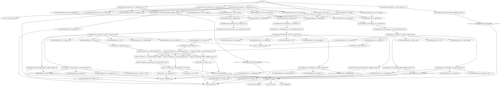

# Terraforming a Three Node Kafka/Zookeeper Cluster on Oracle Bare-Metal Cloud
Ed Shnekendorf, Cloud Platform Architect, Oracle

## Overview
This configuration creates VCN with a route table, internet gateway, security lists, and compute hosts for a 3 node [Zookeeper](https://zookeeper.apache.org/) and [Kafka](https://kafka.apache.org/) cluster.

In addition to setting up the network and hosts, the configuration also bootstraps the Zookeeper and Kafka config onto the raw VMs and installs and configures all the required software.

The outputs provide a remote start script and Kakfa connect string to be used with Kafka clients.

Terraform leverages underlying cloud APIs to declaratively orchestrate complex infrastructures and maintain that configuration as change occurs.  For example, the configuration in this project builds the following set of dependencies in Oracle Cloud


It is helpful to understand Terraform before modifying this code for your own purposes.  A great resource that I used to learn was this [excellent book](http://www.terraformupandrunning.com/) by Jim Brikman.

## Software Requirements
To run this you must have installed the [Terraform](https://www.terraform.io/downloads.html) binary (at least 0.9.x) and configured it per instruction.  

You must also have installed the [Oracle Bare Metal Cloud Terraform provider](https://github.com/oracle/terraform-provider-baremetal/releases).

You will also, of course, need access to an Oracle Bare Metal Cloud Service (BMCS) account.  If you do not have access, you can request a [free trial](https://cloud.oracle.com/en_US/tryit).  To learn more about Oracle BMCS, read the [Getting Started](https://docs.us-phoenix-1.oraclecloud.com/Content/GSG/Concepts/baremetalintro.htm) guide.

If you're working on Windows, it is handy to have a proper shell environment to operate in.  For this, I use [Babun](http://babun.github.io/).

## Environment Requirements
Follow all instructions for installing the Terraform and Oracle Bare Metal Provider executables.

You will also need to define 4 environment variables which are used by this configuration as expected inputs.  Below are samples with the actual values truncated:

**TF_VAR_tenancy_ocid**=ocid1.tenancy.oc1..aaaaaaaao5t5qdwrzz....  
**TF_VAR_fingerprint**=57:20:5d:2b:81:69:2f:...  
**TF_VAR_private_key_path**=/home/eshneken/keys/api-signing-key-bmcs.pem  
**TF_VAR_user_ocid**=ocid1.user.oc1..aaaaaaaafhe4v...  

Note that the private key referenced as well as its fingerprint is a PEM key used for API signing and not an RSA SSH key.  Read more about how to configure the above environment variables as it relates to Oracle BMCS [here](https://docs.us-phoenix-1.oraclecloud.com/Content/API/Concepts/apisigningkey.htm).

You will also need to generate an OpenSSH public/private keypair to facilitate SSH access to your instances.  This project expects those keys to be called **private.key** and **public.key** and to be located in the **userdata** directory.  Make sure the file permissions are appropriate for SSH keys:

```css
-rw-r--r-- 1 eshneken None 1675 May 15 13:21 private.key
-rw-r--r-- 1 eshneken None  409 May 15 15:26 public.key
```
You can read about how to create SSH keys correctly in [this section](https://docs.us-phoenix-1.oraclecloud.com/Content/GSG/Tasks/creatingkeys.htm) of the BMCS Getting Started Guide.

## Project Organization
The root directory contains a **main.tf** file which is the root configuration and which leverages a number of modules to build up the configuration.  In general order of execution, those modules are:
 * **vcn**: Builds the virtual cloud network (vcn), subnets, route table, and security lists for the cluster.  The security lists define strict traffic rules specific to Kakfa/Zookeeper requirements
 * **compute-instance**:  Builds an Oracle Linux 7 (OL7) compute instance.  Code is provided to build additional block storage and attach but I've commented it out since it is not necessary for the sample.  This module is referenced from main.tf three times to build the three node members each in a different availability domain in the region.
 * **kafka-config**:  This module takes the three vanilla compute instances and configures them for Kafka and Zookeerper.  It leverages a number of [file](https://www.terraform.io/docs/provisioners/file.html) and [remote-exec](https://www.terraform.io/docs/provisioners/remote-exec.html) calls.  Because Terraform provisioners cannot be applied to modules, I've taken the shortcut of binding them to dummy storage volumes that are created.  This is a bit of a hack but this scheme works by staging them after instance creation and allowing the three to configure in parallel.  In the real world, the bootstrapping may be done using a tool like Chef/Puppet/Ansible and gold images of the VMs (with all the software pre-loaded) could be created as Docker containers and Terraform used only for the cloud provisioning;  however, for the purpose of this sample I wanted to keep everything unified in a single, simple repository with a minimal toolchain.
 
Each module has a *main.tf* file which describes the module configuration.  Datasources are defined in *datasources.tf*, input variables are defined in *vars.tf*, and output variables are defined in *outputs.tf*.  I've tried to use these naming conventions consistently throughout the project.
 
The **userdata** directory, in addition to the SSH keyfiles that you must place there, also contains some bash scripts which are uploaded to each compute instance and run as part of the **kafka-provision** step.
 
## Running the Sample
Once you understand the code, have all the software requirements, and have satisfied the environmental requirements you can build your environment.

The first step is to parse all the modules by typing **terraform get**.  This will build out a .terraform directory in your project root.  This needs to be done only once.

The next step is to run **terraform plan** from the command line to generate an execution plan.  Examine this plan to see what will be built and that there are no errors.

If you are satisfied, you can build the configuration by typing **terraform apply**.  This will build all of the dependencies and construct an environment to match the project.  I have seen some instances where the apply will fail midway through but the resolution is simply to type **terraform apply** again and the configuration will complete.  Remember that terraform is indepotent so you can run *apply* as many times as you want and Terraform will sync the config for you.

Note that Terraform generates a *terraform.tfstate* and *terraform.tfstate.backup* file which manage the state of your environment.  These files should not be hand edited.

If you want to tear down your environment, you can do that by running **terraform destroy**

## Testing the Sample
Once your apply completes, you should see some output information that looks like this:

 kafka_cluster_address = 129.142.26.83:9092,129.126.3.130:9092;129.146.18.251:9092 
 kafka_start_command = ./startKafkaRemote.sh 129.146.13.93 129.142.3.110 129.143.28.251

You can start your Zookeeper/Kafka cluster by copying the *kafka_start_command* into your shell and executing.  This will issue remote SSH commands to each of the nodes in the cluster to execute their startup sequence.

Now that your cluster is up and running, you can test using any client by providing the cluster address outputted in *kafka_cluster_address*.  You can use any code that leverages Kafka;  I tested using the sample consumer/producer code referenced in [this blog](https://community.oracle.com/community/cloud_computing/oracle-cloud-developer-solutions/blog/2017/01/05/microservices-messaging-on-oracle-cloud-using-apache-kafka).  You can ignore all the details on setting up Kafka (you've already terraformed that) and pushing to Oracle Container Cloud; just grab the code and run inside your favorite IDE.